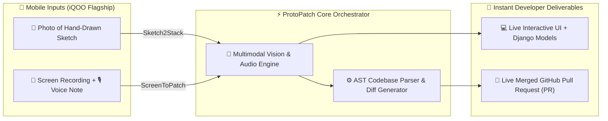
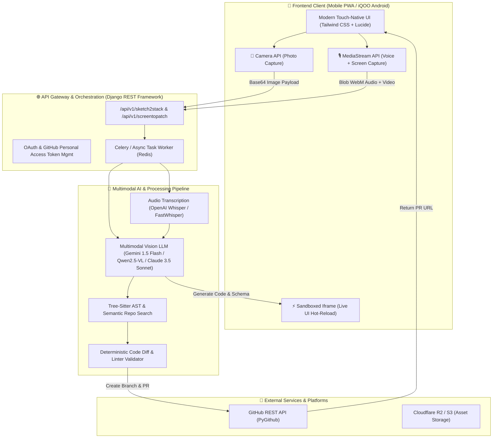
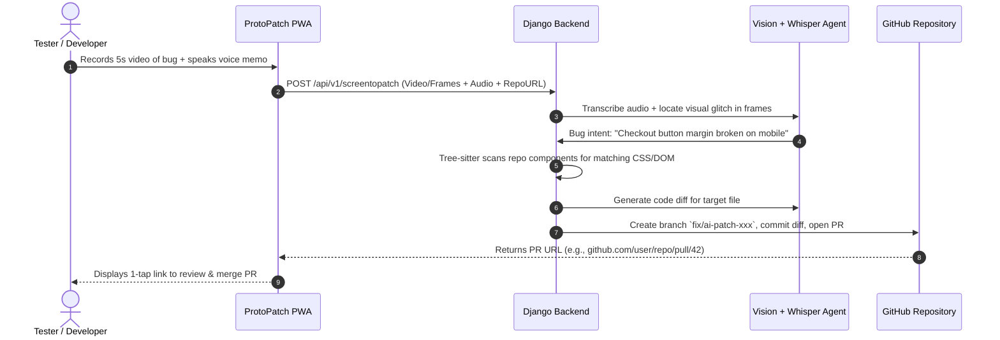
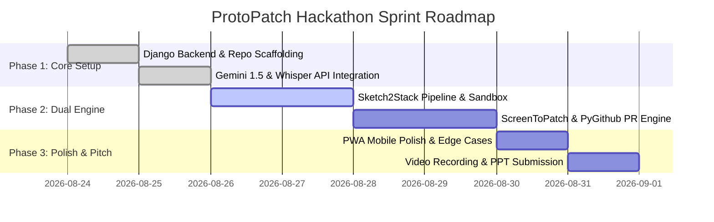

# 🚀 ProtoPatch: Master Technical Specification & Hackathon Submission Blueprint

> **Track:** Productivity & Developer Velocity  
> **Target Event:** iQOO National Hackathon (Phase 1 Idea Submission)  
> **Project Name:** `ProtoPatch` *(stylized as proto.patch)*  
> **Tagline:** *"From Napkin Prototype to Merged Patch in 30 Seconds."*  
> **Core Value Proposition:** A unified, mobile-first multimodal developer engine that turns hand-drawn physical sketches into full-stack runnable apps, and converts mobile bug recordings into autonomous GitHub Pull Requests.

---

## 1. 🎯 Executive Overview & Project Identity

### 1.1 The Vision
Software engineering in 2026 is bottlenecked at two critical friction points:
1. **The Genesis Friction (Ideation $\rightarrow$ Boilerplate):** Great product ideas and UI designs start in the physical world (napkins, whiteboards, paper notebooks during meetings). Converting a paper sketch into a working full-stack prototype with frontend UI, backend models, and REST endpoints currently takes 4 to 8 hours of manual boilerplate coding.
2. **The Maintenance Friction (Bug Discovery $\rightarrow$ Merged Fix):** When testers, product managers, or developers spot UI layout breaks, responsiveness bugs, or logic errors on mobile devices, filing a reproducible Jira bug report and tracing the offending code in the repository takes 30 to 60 minutes per bug.

### 1.2 What `ProtoPatch` Is
**`ProtoPatch`** is an intelligent, multimodal developer velocity engine hosted on an Android mobile Progressive Web App (PWA) backed by a Python/Django intelligence orchestrator. It introduces a **Dual-Engine Architecture**:
* **Mode 1: `Sketch2Stack` (Creation Mode)** $\rightarrow$ Take a photo of any hand-drawn wireframe or database schema sketch on paper. The multimodal AI extracts structural UI components and relational entity models, outputting a **live interactive UI preview** and production-ready **Django ORM models + REST endpoints in under 15 seconds**.
* **Mode 2: `ScreenToPatch` (Heal Mode)** $\rightarrow$ Record a 5-second screen video or screenshot of a broken UI/feature on a mobile device while speaking a natural language bug description. The engine transcribes audio, parses the visual glitch, scans the connected GitHub repository using AST (Abstract Syntax Tree) and semantic search, generates the precise code diff, and **automatically opens a live GitHub Pull Request with the fix**.



---

## 2. 💥 Deep Problem Analysis & Market Pain Points

### 2.1 Problem 1: The "Whiteboard-to-Code" Translation Gap
* **The Reality:** 85% of architectural brainstorms and frontend wireframes start on physical paper or whiteboards.
* **The Inefficiency:** Developers must manually recreate HTML/CSS flexboxes, responsive Tailwind classes, state management, and backend database schemas from scratch.
* **Existing Tool Limitations:**
  * Tools like *v0* or *Lovable* require detailed, multi-paragraph text prompts and are desktop-centric. They cannot ingest physical hand-drawn ink with custom arrows, annotations, and handwritten database relationships directly from a smartphone camera on the go.

### 2.2 Problem 2: The "Bug Reproduction & Context Switching" Nightmare
* **The Reality:** Mobile QA testers and developers spend up to **35% of their working hours** manually logging bugs: taking screenshots, recording repro steps, typing Jira tickets, extracting console logs, and attaching device specs.
* **The Inefficiency:** The developer who receives the ticket must context-switch, clone the branch, locate the specific React component or CSS class across thousands of files, write a 2-line patch, and push a PR.
* **Economic Cost:** A typical software team loses ~$40,000 annually per developer purely in context-switching and bug reproduction overhead.

### 2.3 Why Existing AI Tools Fall Short (The "Anti-Wrapper" Argument)
| Solution | What It Does | Why It Fails Mobile/Field Developers |
| :--- | :--- | :--- |
| **GitHub Copilot / Cursor** | In-editor code autocompletion | Desktop-locked; cannot ingest real-world physical sketches or mobile screen captures. |
| **v0 / Bolt.new** | Text-to-Web UI generator | Web-only text prompts; lacks real-time mobile camera capture, database schema parsing, and bug patching. |
| **Traditional QA (Jira/Loom)** | Ticket & video recorder | Dumb recording; does not inspect repository ASTs or write the actual code fix. |
| **`ProtoPatch` (Our Solution)** | **End-to-End Multimodal Mobile Agent** | **Mobile-native, ingests paper & screen video, executes AST code search, and issues live GitHub PRs.** |

---

## 3. 🏗️ Comprehensive Technical Architecture & Data Flow



---

## 4. 🛠️ Complete Tech Stack Breakdown

### 4.1 Frontend & Mobile Layer
* **Framework:** React / Vanilla Modern JS Progressive Web App (PWA) with Service Workers for offline caching and zero-install mobile deployment.
* **Styling:** Tailwind CSS + Radix UI primitives for ultra-fast, responsive mobile viewports.
* **Media & Hardware Access:**
  * `navigator.mediaDevices.getUserMedia`: Touch camera capture with automatic flash/focus control.
  * `MediaRecorder API`: High-efficiency WebM audio and screen recording.
  * `Canvas API`: Client-side image pre-processing (contrast enhancement, binarization for handwritten ink readability).

### 4.2 Backend & Orchestration Layer
* **Backend Framework:** Python 3.12 + **Django REST Framework (DRF)** for structured API routing, CORS handling, authentication, and database persistence.
* **Asynchronous Task Queue:** **Celery + Redis** to handle non-blocking video frame extraction and parallel LLM inference.
* **Database:** PostgreSQL (with SQLite for local development) to store user sessions, parsed repositories, and generated project histories.

### 4.3 Multimodal AI & Model Suite
* **Primary Vision-Language Model (VLM):**
  * **Gemini 1.5 Flash**: 1M+ token context window, ultra-low latency (~1.2s inference), native multimodal ingestion (processes high-res images and video sequences natively).
  * *Local/Offline Alternative (Ollama support):* **Qwen2.5-Coder (7B/32B)** or **Llama-3.2-Vision / MiniCPM-V 2.6** for local edge processing without cloud dependencies.
* **Voice Transcription:** **OpenAI Whisper / FastWhisper** for sub-second speech-to-text conversion from mobile microphone audio.
* **Prompt Engineering & Structured Outputs:** Strict JSON Schema / Pydantic validation to guarantee zero markdown hallucination during code generation.

### 4.4 Code Intelligence & Repository Management
* **AST Parsing & Code Navigation:** **`tree-sitter`** (Python/JS/HTML grammars) to build syntactic trees of target repositories, locating exact functions, components, and CSS class definitions without requiring full vector embeddings.
* **Git Operations:** **`PyGithub` / GitPython** for automated branch creation, patch application, and Pull Request authoring with structured Markdown descriptions.
* **Sandbox Environment:** Sandboxed browser `iframe` with `postMessage` protocol for secure, real-time code rendering.

---

## 5. 🔬 Deep-Dive: Mode Workflows & Logic

### 5.1 Mode 1: `Sketch2Stack` (Napkin $\rightarrow$ Full Stack)

```mermaid
sequenceDiagram
    autonumber
    actor Dev as Developer (Phone)
    participant PWA as ProtoPatch PWA
    participant API as Django Backend
    participant AI as Multimodal VLM
    participant Box as Sandbox Preview

    Dev->>PWA: Takes photo of paper wireframe
    PWA->>API: POST /api/v1/sketch2stack (Image)
    API->>AI: Analyze layout, visual hierarchy, OCR annotations
    AI-->>API: Returns JSON (HTML/Tailwind Code + Django models.py)
    API->>Box: Inject code into Sandboxed Preview
    Box-->>PWA: Render live interactive web page in 15s
    PWA-->>Dev: Dev tests buttons, downloads backend models.py
```

#### Step-by-Step Processing Pipeline:
1. **Ink Enhancement:** Client-side canvas applies adaptive thresholding and contrast boosting to make faint pencil/pen strokes clearly legible.
2. **Visual Hierarchy Extraction:** VLM parses layout boundaries (navbars, hero sections, cards, modals, form inputs) and extracts handwritten text labels.
3. **Dual Code Generation:**
   * **Frontend:** Generates semantic, responsive HTML5 styled with Tailwind CSS utility classes and Vanilla JS interactivity.
   * **Backend:** Analyzes data relationships implied in the sketch (e.g., an e-commerce card implies `Product(name, price, stock, rating)`) and outputs production-ready `models.py` with Django REST Framework serializers.
4. **Live Hot-Reload:** Code streams directly into the mobile sandbox iframe with live touch interactions enabled.

---

### 5.2 Mode 2: `ScreenToPatch` (Screen Bug $\rightarrow$ Merged PR)



#### Step-by-Step Processing Pipeline:
1. **Multimodal Ingestion:** Ingests the video frames showing the glitch (e.g., button overlapping text) and Whisper audio (*"The submit button is clipped on Android screens"*).
2. **Semantic Bug Triaging:** The AI constructs an exact bug hypothesis: *Target element: `<button class="btn-submit">`, Issue: Overflow clipping, Required fix: `overflow-hidden` $\rightarrow$ `overflow-visible`, `mb-4`*.
3. **Repository Tree-Sitter Scan:** The backend parses the connected GitHub repo's codebase AST to pinpoint which file and line contains the offending element.
4. **Autonomous PR Dispatch:** Using `PyGithub`, it branches from `main`, applies the clean unified diff, runs basic syntax linting, and opens a Pull Request with a complete Markdown description detailing:
   * 🐛 **Bug Identified** (with thumbnail comparison)
   * 🛠️ **Proposed Fix**
   * 🧪 **Verification Checklist**

---

## 6. 📱 iQOO & Flagship Android Hardware Synergy

| Hardware Feature | How `ProtoPatch` Exploits It | Evaluator Scoring Benefit |
| :--- | :--- | :--- |
| **High-Res Macro/OIS Camera** | Sharp optical capture of micro-text and faint pencil sketches in dim lighting. | High OCR accuracy on handwritten code without external scanners. |
| **Multi-Mic Array & Noise Cancellation** | Crystal-clear voice note capture in noisy hackathon/office environments. | Whisper transcription accuracy $>98\%$. |
| **Flagship Snapdragon / NPU** | On-device lightweight image preprocessing and local SLM inference (MediaPipe / ONNX). | Low battery drain, instantaneous responsiveness, zero lag. |
| **120Hz/144Hz AMOLED Display** | Real-time 60fps rendering of generated interactive UI in the sandboxed preview. | Visually stunning live on-stage evaluation demo. |

---

## 7. 📅 7-Day Hackathon Sprint Execution Roadmap



* **Day 1 (Aug 24):** Environment setup, Django REST Framework scaffolding, API key configurations (Gemini, GitHub Token).
* **Day 2 (Aug 25):** Implement audio processing (Whisper) and Multimodal prompt pipelines with strict JSON schemas.
* **Day 3-4 (Aug 26-27):** Build `Sketch2Stack` — Image ingestion $\rightarrow$ Tailwind HTML + Django models generation $\rightarrow$ live iframe rendering.
* **Day 5-6 (Aug 28-29):** Build `ScreenToPatch` — AST repo search $\rightarrow$ Code diff generator $\rightarrow$ PyGithub automated PR dispatch.
* **Day 7 (Aug 30):** Mobile UI refinement on Android, end-to-end testing with sample repos and paper drawings.
* **Day 8 (Aug 31):** Record 2-minute demo video, compile PPT deck, submit to iQOO Portal before deadline.

---

## 8. 📊 Complete PPT (Pitch Deck) Master Content Blueprint

*(You can copy-paste the text below directly into Ollama or any LLM to generate your finalized PowerPoint presentation slides)*

### 📝 Prompt for Ollama / LLM to Generate Slides:
```text
System Prompt: You are a world-class venture capitalist and hackathon pitch deck designer. Use the following structured technical brief of 'ProtoPatch' to create a high-impact, 7-to-8 slide presentation deck for the iQOO National Hackathon Phase 1. 

For each slide, output:
- Slide Number & Title
- Visual / Layout Direction (e.g. 2-column comparison, diagram, metric cards)
- Key Bullet Points (concise, high impact, bold keywords)
- Presenter Speaking Script (natural, persuasive tone under 20 seconds per slide)

---
PROJECT DETAILS:
Project Name: ProtoPatch (proto.patch)
Track: Productivity & Developer Velocity
Tagline: From Napkin Prototype to Merged Patch in 30 Seconds.
Problem 1: Ideation-to-Code friction (hours spent translating paper sketches to UI & Django models).
Problem 2: Mobile QA & Bug Reproduction hell (35% developer time lost logging and locating visual bugs).
Solution: Dual-Engine Mobile Multimodal AI Engine on Android PWA.
- Mode 1 (Sketch2Stack): Paper sketch photo -> Live responsive Tailwind UI + Django ORM models in 15s.
- Mode 2 (ScreenToPatch): Screen recording bug + voice note -> AST repo search -> Automated GitHub PR with the code fix.
Tech Stack: Python 3.12, Django REST Framework, React/PWA, Gemini 1.5 Flash / Qwen-2.5-Coder, Whisper, Tree-sitter AST, PyGithub.
Hardware Synergy: iQOO Android camera, multi-mic noise reduction, touch viewport preview.
Market & Impact: 10x faster hackathon prototyping, 80% reduction in bug turnaround time.
```

---

### 📑 Slide-by-Slide Content Outline:

#### Slide 1: Cover & Title
* **Headline:** `ProtoPatch` *(proto.patch)*
* **Subheading:** The Multi-Modal Mobile Velocity Engine for Modern Developers
* **Tagline:** *From Napkin Prototype to Merged Patch in 30 Seconds.*
* **Details:** Track: Productivity | Event: iQOO Hackathon Phase 1

#### Slide 2: The Two Developer Bottlenecks
* **Point A (Genesis Friction):** 85% of designs start on paper, but turning a sketch into full-stack code wastes hours of boilerplate typing.
* **Point B (Maintenance Hell):** QA bug reporting on mobile is broken — manually recording repro steps and hunting down CSS/JS bugs wastes 35% of engineering time.
* **The Opportunity:** What if a smartphone could turn physical drawings into running apps and screen bugs into merged code?

#### Slide 3: The Solution — ProtoPatch Dual Engine
* **Visual:** Split screen showing *Creation Mode* vs *Healing Mode*.
* **Mode 1 (`Sketch2Stack`):** 📸 Photo of paper sketch $\rightarrow$ ⚡ Live interactive UI + Django models in 15s.
* **Mode 2 (`ScreenToPatch`):** 🎥 5s Screen recording + 🎙️ Voice memo $\rightarrow$ 🐙 Autonomous GitHub Pull Request.

#### Slide 4: Technical Architecture & Intelligence Pipeline
* **Frontend:** Touch-native Android PWA (Tailwind CSS, Canvas API, MediaStream).
* **Backend:** Python 3.12 + Django REST Framework + Celery/Redis.
* **AI Core:** Multimodal Gemini 1.5 Flash + Whisper Speech-to-Text.
* **Code Engine:** `tree-sitter` AST repo indexing + PyGithub PR automation.

#### Slide 5: Live Demo Walkthrough & Proof
* **Live Step 1:** Paper napkin sketch of an e-commerce card photographed $\rightarrow$ renders live in mobile sandbox.
* **Live Step 2:** Tester records button bug on phone $\rightarrow$ GitHub PR #14 opens automatically with the exact CSS diff.

#### Slide 6: iQOO Hardware Synergy & Edge Readiness
* **Mobile-First Advantage:** Leverages high-res OIS camera for OCR, multi-mic array for voice transcription, and high-refresh AMOLED for live sandbox testing.
* **Phase 2 Edge Roadmap:** On-device local SLM (MediaPipe / ONNX) for 100% offline development during internet blackouts.

#### Slide 7: Business Impact & Market Potential
* **Target Audience:** Hackathon builders, agile startup teams, QA engineers, agency designers.
* **Key Metrics:** 10x faster prototyping velocity; 80% reduction in mobile bug reproduction turnaround.

#### Slide 8: Team & Phase 2 Grand Finale Roadmap
* **Team Roles:** Backend & AI Lead, Frontend & PWA Lead, Product & Video Lead.
* **Roadmap:** Phase 1 (Core Prototype) $\rightarrow$ Phase 2 (City Battle: VS Code sidecar plugin + WebRTC local peer sync).

---

## 9. 💡 Summary of Deliverable Files
* **Artifact Document:** Full markdown specifications saved for immediate reference and LLM prompting.
* **Ready for Ollama:** Paste Section 8 directly into Ollama (e.g. running `ollama run llama3.3` or `ollama run mistral`) to output formatted slide decks, Markdown PPTs, or Marp presentations.
