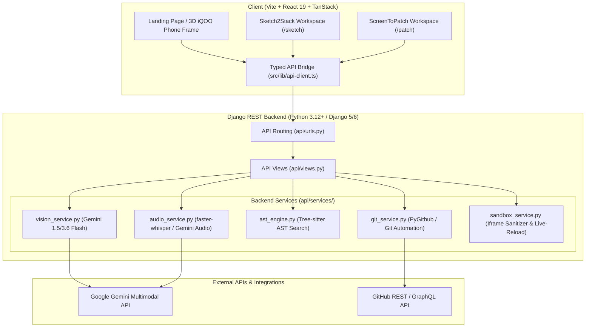
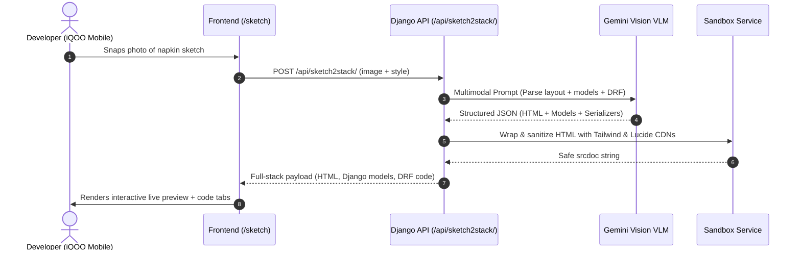
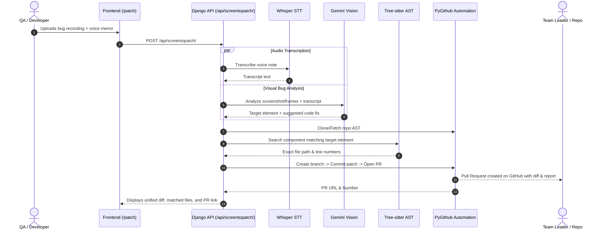

# ⚡ ProtoPatch — Complete Project Architecture & Folder Structure Documentation

> **Event**: iQOO National Hackathon — Productivity Track  
> **Project Name**: ProtoPatch (`proto.patch`)  
> **Tagline**: *From napkin prototype to running full-stack app in 15 seconds. From 5-second mobile bug recording to merged GitHub PR in 30 seconds.*

---

## 📋 Table of Contents

1. [Project Overview & Core Mission](#1-project-overview--core-mission)
2. [High-Level System Architecture](#2-high-level-system-architecture)
3. [Complete Folder Structure](#3-complete-folder-structure)
4. [Frontend Architecture (`src/`)](#4-frontend-architecture-src)
5. [Backend Architecture (`backend/`)](#5-backend-architecture-backend)
6. [Core Services Deep Dive](#6-core-services-deep-dive)
7. [API Endpoints Reference](#7-api-endpoints-reference)
8. [End-to-End Data Pipelines](#8-end-to-end-data-pipelines)
9. [Configuration & Environment Variables](#9-configuration--environment-variables)
10. [Local Development & Deployment Guide](#10-local-development--deployment-guide)

---

## 1. Project Overview & Core Mission

ProtoPatch is a **multimodal AI developer velocity engine** designed for modern mobile-first development workflows (optimized for flagship mobile devices like iQOO). It tackles the two largest friction points in modern software engineering:

```
┌────────────────────────────────────────────────────────────────────────────────────────┐
│                                 ⚡ PROTOPATCH ENGINES                                  │
├─────────────────────────────────────────┬──────────────────────────────────────────────┤
│ ⚡ Engine 1: Sketch2Stack (Genesis)     │ 🩺 Engine 2: ScreenToPatch (Heal)            │
├─────────────────────────────────────────┼──────────────────────────────────────────────┤
│ • Input: Hand-drawn wireframe / napkin  │ • Input: Screen recording + Voice bug memo    │
│ • Vision: Gemini Multimodal Vision      │ • Audio & Code: Whisper STT + Tree-sitter AST│
│ • Output: Live Tailwind HTML UI +       │ • Output: Code localization, Unified Diff,   │
│   Django Models + DRF Serializers       │   Automated GitHub Branch & Pull Request     │
└─────────────────────────────────────────┴──────────────────────────────────────────────┘
```

---

## 2. High-Level System Architecture



---

## 3. Complete Folder Structure

Below is the directory map of the entire project repository:

```
iqoo-hackathon/
├── backend/                                # Python / Django Backend Subsystem
│   ├── backend/                            # Django Project Root
│   │   ├── .venv/                          # Python Virtual Environment
│   │   ├── api/                            # ProtoPatch Core REST Application
│   │   │   ├── __init__.py
│   │   │   ├── apps.py                     # Django App configuration
│   │   │   ├── serializers.py              # DRF Request & Response Serializers
│   │   │   ├── urls.py                     # API URL routing definitions
│   │   │   ├── views.py                    # Class-Based Views for AI endpoints
│   │   │   ├── services/                   # Business Logic & AI Engines
│   │   │   │   ├── __init__.py
│   │   │   │   ├── ast_engine.py           # Tree-sitter AST codebase scanner & parser
│   │   │   │   ├── audio_service.py        # faster-whisper & Gemini STT transcription
│   │   │   │   ├── git_service.py          # PyGithub branch, commit & PR automation
│   │   │   │   ├── sandbox_service.py      # HTML/JS sanitizer & iframe postMessage bridge
│   │   │   │   └── vision_service.py       # Multimodal Gemini Vision wireframe & bug analyzer
│   │   │   └── tests/                      # Automated Django pipeline tests
│   │   │       ├── __init__.py
│   │   │       └── test_pipeline.py        # Mocked service & endpoint test suites
│   │   ├── protopatch_core/                # Django Settings Module
│   │   │   ├── __init__.py
│   │   │   ├── asgi.py                     # ASGI entrypoint
│   │   │   ├── settings.py                 # Django configuration, CORS, .env loading
│   │   │   ├── urls.py                     # Root URLconf routing to /api/
│   │   │   └── wsgi.py                     # WSGI entrypoint
│   │   ├── db.sqlite3                      # Local SQLite database
│   │   ├── manage.py                       # Django CLI entrypoint
│   │   └── requirements.txt                # Python backend package dependencies
│   ├── demo_fixtures/                      # Demo files & fixtures for testing
│   │   └── buggy_react_component.jsx       # Sample buggy component for ScreenToPatch testing
│   ├── .env                                # Local backend environment secrets
│   ├── .env.example                        # Template for environment variables
│   ├── .gitignore                          # Backend gitignore rules
│   ├── README.md                           # Backend documentation & quickstart
│   ├── run_backend.bat                     # 1-click Windows launcher for Django
│   └── run_frontend.bat                    # 1-click Windows launcher for Vite
│
├── public/                                 # Static Assets served by Vite
│   ├── favicon.svg                         # Vector ProtoPatch brand favicon
│   ├── iqoo-back.png                       # High-res authentic iQOO phone back chassis
│   ├── iqoo-front.png                      # High-res authentic iQOO wallpaper graphic
│   ├── manifest.json                       # Progressive Web App (PWA) manifest
│   └── og.jpg                              # Open Graph preview image
│
├── src/                                    # Frontend Application Source (React 19 + TypeScript)
│   ├── components/                         # UI Components
│   │   ├── app/                            # Working Prototype / Tool Components
│   │   │   ├── app-header.tsx              # Tool navigation bar with mode switcher
│   │   │   ├── audio-recorder.tsx          # Real-time Web Audio API waveform recorder
│   │   │   ├── code-block.tsx              # Syntax-highlighted code viewer with copy
│   │   │   ├── diff-viewer.tsx             # Unified Git diff visualizer
│   │   │   ├── file-dropzone.tsx           # Drag-and-drop wireframe & screenshot uploader
│   │   │   ├── file-tree-explorer.tsx      # Interactive GitHub repository file tree explorer
│   │   │   ├── pipeline-progress.tsx       # Real-time AI pipeline stage tracker
│   │   │   ├── stack-selector.tsx          # Target tech stack configuration picker
│   │   │   └── vibe-chat-bar.tsx           # Natural language prompt & vibe refinement bar
│   │   │
│   │   └── site/                           # Landing Page & Interactive 3D Showcase
│   │       ├── architecture.tsx            # Dual-engine architectural diagram section
│   │       ├── button.tsx                  # Reusable button with variants & micro-animations
│   │       ├── compare.tsx                 # Competitive comparison matrix (v0 / Cursor / Bolt)
│   │       ├── custom-cursor.tsx           # Architectural HUD reticle mouse follower
│   │       ├── demo-context.tsx            # Global state context for the interactive stage
│   │       ├── demo-stage.tsx              # Interactive dual-engine 3D phone sandbox
│   │       ├── engines.tsx                 # Genesis & Heal engine feature highlight cards
│   │       ├── floating-cta.tsx            # Fixed floating launchdock for quick navigation
│   │       ├── footer.tsx                  # Site footer with brand info & links
│   │       ├── header.tsx                  # Global sticky navigation with theme toggle & links
│   │       ├── hero.tsx                    # Hero banner with text reveal & action buttons
│   │       ├── home-page.tsx               # Assembled Landing Page composite component
│   │       ├── iqoo-home-screen.tsx        # Simulated iQOO OS mobile lock/home screen
│   │       ├── logo.tsx                    # Vector SVG ProtoPatch brand mark
│   │       ├── napkin-sketch.tsx           # Hand-drawn wireframe preview generator
│   │       ├── patch-screen.tsx            # Simulated ScreenToPatch phone app screen
│   │       ├── phone-frame.tsx             # 3D interactive tiltable/flippable iQOO phone frame
│   │       ├── sketch-screen.tsx           # Simulated Sketch2Stack phone app screen
│   │       ├── stack.tsx                   # Tech stack showcase grid
│   │       ├── status-bar.tsx              # Mobile status bar with time, wifi, and battery
│   │       └── text-reveal.tsx             # Word-by-word clip-masked typographic reveal
│   │
│   ├── lib/                                # Utilities & Shared Libraries
│   │   ├── api-client.ts                   # Strongly-typed Axios/Fetch client for Django API
│   │   ├── db.ts                           # PGlite client / Local database utilities
│   │   ├── error-component.tsx             # Error boundary fallback UI
│   │   ├── utils.ts                        # Tailwind `cn()` helper & formatting utilities
│   │   ├── app-data/                       # Client & server data access layers
│   │   ├── auth/                           # Authentication helpers & session gating
│   │   ├── multiplayer/                    # P2P multiplayer & live synchronization
│   │   └── og/                             # Dynamic OpenGraph image generation metadata
│   │
│   ├── routes/                             # TanStack Router File-Based Pages
│   │   ├── __root.tsx                      # Root route layout (Navbar, Cursor, Providers)
│   │   ├── index.tsx                       # Home page entry (`/`)
│   │   ├── sketch.tsx                      # Standalone Sketch2Stack Tool page (`/sketch`)
│   │   └── patch.tsx                       # Standalone ScreenToPatch Tool page (`/patch`)
│   │
│   ├── routeTree.gen.ts                    # Auto-generated TanStack route tree
│   ├── router.tsx                          # TanStack router instantiation
│   └── styles.css                          # Global design system tokens & CSS variables
│
├── scripts/                                # Build, Test & Migration Automation Scripts
│   ├── app-env-plugin.mjs                  # Environment variable injector for Vite
│   ├── brand-check.mjs                     # Brand compliance & asset validator
│   ├── browser-smoke.mjs                   # Automated Puppeteer/Playwright smoke test
│   └── grok-pwa-plugin.mjs                 # PWA service worker compiler
│
├── .gitignore                              # Workspace Git ignore definitions
├── .prettierrc                             # Code formatting rules
├── eslint.config.mjs                       # ESLint linting configuration
├── package.json                            # Frontend dependencies & npm scripts
├── package-lock.json                       # Exact locked npm dependency graph
├── tsconfig.json                           # TypeScript configuration
├── vite.config.ts                          # Vite build pipeline & server settings
├── README.md                               # Root project overview & documentation
└── detail.md                               # Comprehensive project structure & design guide
```

---

## 4. Frontend Architecture (`src/`)

The frontend is built on **React 19**, **Vite**, **Tailwind CSS**, and **TanStack Router**, with physics-based 3D animations powered by **Motion (Framer Motion)**.

### A. Routes (`src/routes/`)

1. **`__root.tsx`**: The top-level layout wrapper that mounts the custom architectural HUD cursor, navigation headers, and toast/notification contexts.
2. **`index.tsx`**: Landing page showcasing the dual engines, interactive 3D iQOO phone simulator, technical comparisons, and live demonstrations.
3. **`sketch.tsx`**: The production **Sketch2Stack** workbench. Allows users to upload/snap napkin wireframes, configure target frameworks (React, Vue, Django, FastAPI), preview generated Tailwind HTML inside a live sandboxed iframe, inspect Django models, and iterate via vibe prompts.
4. **`patch.tsx`**: The production **ScreenToPatch** workbench. Accepts bug screenshots/video recordings and audio voice memos, connects to GitHub repos, scans the file tree, parses AST diffs, and triggers automated Pull Request dispatch.

### B. Interactive 3D Phone Simulator (`src/components/site/phone-frame.tsx`)

The centerpiece of the landing experience is an interactive, physics-based 3D device model of the **iQOO flagship phone**:
- **Front Face**: Displays an authentic iQOO OS screen (`iqoo-home-screen.tsx`) featuring real-time clock, status indicators (5G, WiFi, Battery), and a "Try the APP" launcher that opens live running prototypes.
- **Back Face**: Authentic iQOO chassis featuring the BMW M-stripe racing livery, quad-camera module with 100x zoom telephoto lens, and metallic chassis edges.
- **3D Tilt & Flip**: Uses pointer movement physics for reactive 3D perspective tilt and a 180° turnaround flip button.

### C. Prototype Components (`src/components/app/`)

- **`audio-recorder.tsx`**: Visualizes microphone input in real-time with an HTML5 canvas audio waveform before sending audio to the STT pipeline.
- **`file-tree-explorer.tsx`**: Loads live repository directory trees via GitHub API, allowing developers to visually select target source files.
- **`diff-viewer.tsx`**: Color-coded syntax diff viewer that highlights additions (`+`) and deletions (`-`) generated by the AI patch engine.
- **`code-block.tsx`**: Multi-tab code viewer with syntax highlighting and 1-click clipboard copying.
- **`vibe-chat-bar.tsx`**: Conversational bar enabling continuous prompt-based styling iterations on generated prototypes.

---

## 5. Backend Architecture (`backend/`)

The backend is built with **Python 3.12+**, **Django 5/6**, and **Django REST Framework (DRF)**.

```
backend/backend/
├── protopatch_core/
│   ├── settings.py           # CORS config, dynamic secret keys, GEMINI & GITHUB env vars
│   └── urls.py               # Main router mounting /api/ endpoints
└── api/
    ├── views.py              # API Endpoint handlers
    ├── serializers.py        # Input validation & schema definitions
    └── services/             # Core engineering & AI service layers
```

---

## 6. Core Services Deep Dive

The core logic is modularized inside `backend/backend/api/services/`:

### 1. `vision_service.py` (Multimodal AI Pipeline)
- **Engine**: Google Gemini 1.5 / 3.6 Flash Multimodal Vision API.
- **Sketch2Stack Mode**: Analyzes uploaded sketches or wireframes, performs OCR on handwritten labels, extracts layout hierarchies, and generates:
  - Clean, responsive HTML5 + Tailwind CSS.
  - Django ORM `models.py` (with correct field types, primary keys, relationships).
  - Django REST Framework `serializers.py`.
- **ScreenToPatch Mode**: Compares bug screenshots or video keyframes with expected behavior, identifying CSS overflows, misalignment, rendering glitches, or broken logic.

### 2. `audio_service.py` (Speech-to-Text Transcriber)
- **Engine**: `faster-whisper` (running offline on CPU with `tiny`/`base` models for near-zero latency) + Gemini Audio API fallback.
- Transcribes user voice memos into structured bug reports, extracting bug symptoms, affected components, and developer intent.

### 3. `ast_engine.py` (Tree-sitter AST Code Search)
- **Engine**: `tree-sitter-languages` for syntax parsing across JavaScript, TypeScript, JSX, TSX, and Python.
- Performs semantic code searches across the repository without requiring manual regex searching.
- Pinpoints the exact function, JSX node, or CSS rule causing the reported bug and applies atomic AST-level patches.

### 4. `git_service.py` (GitHub PR Automation)
- **Engine**: `PyGithub` and pure-python Git tooling.
- Authenticates using a GitHub Personal Access Token (PAT).
- Features:
  - Fetches repository tree and file contents.
  - Creates atomic feature branches (e.g., `fix/protopatch-<timestamp>`).
  - Commits verified code patches.
  - Opens complete Pull Requests with markdown bug descriptions, test steps, and unified diff previews.

### 5. `sandbox_service.py` (Live Preview Sanitizer)
- Sanitizes incoming AI-generated HTML/JavaScript.
- Injects Tailwind CSS CDN and Lucide Icon scripts into the `<head>`.
- Injects a `postMessage` listener for hot-reloading iframe previews without requiring page reloads.

---

## 7. API Endpoints Reference

### `GET /api/health/`
Checks backend operational status and verified AI service keys.

**Response:**
```json
{
  "success": true,
  "status": "ok",
  "version": "1.0.0",
  "gemini_configured": true,
  "github_configured": true
}
```

---

### `POST /api/sketch2stack/`
Converts wireframe images into full-stack code.

**Request Payload (`multipart/form-data`):**
| Parameter | Type | Required | Description |
|---|---|---|---|
| `image` | File | Yes | Photo of hand-drawn wireframe or diagram |
| `notes` | String | No | Additional context or domain instructions |
| `style` | String | No | Theme: `auto`, `dark`, `light`, `minimal` |

**Response Payload:**
```json
{
  "success": true,
  "html_code": "<!DOCTYPE html>\n<html lang=\"en\">...",
  "django_models": "from django.db import models\n\nclass Product(models.Model):...",
  "drf_serializers": "from rest_framework import serializers\n\nclass ProductSerializer(serializers.ModelSerializer):...",
  "detected_components": ["NavigationBar", "HeroSection", "ProductGrid", "OrderSummary"],
  "sandbox_html": "<!DOCTYPE html>..."
}
```

---

### `POST /api/screentopatch/`
Analyzes bug media and dispatches an automated Pull Request.

**Request Payload (`multipart/form-data`):**
| Parameter | Type | Required | Description |
|---|---|---|---|
| `screenshot` | File | Optional* | Screenshot image of the UI bug |
| `video` | File | Optional* | Video recording of the bug flow |
| `audio` | File | Optional | Voice memo describing the bug |
| `repo_url` | String | Yes | Target GitHub repository URL |
| `branch` | String | No | Base branch (default: `main`) |
| `notes` | String | No | Written bug report / reproduction steps |

*\*Either `screenshot` or `video` is required.*

**Response Payload:**
```json
{
  "success": true,
  "bug_description": "Price badge exceeds bounds of the mobile container on viewport < 375px.",
  "target_element": ".product-price-badge",
  "suggested_fix": "Add overflow-hidden and adjust negative margin from -top-3 to top-1.",
  "css_or_logic_diff": "--- a/src/components/ProductCard.tsx\n+++ b/src/components/ProductCard.tsx\n@@ -24,3 +24,3 @@\n- <span className=\"-top-3 absolute\">\n+ <span className=\"top-1 absolute overflow-hidden\">",
  "transcript": "The price badge is clipping outside the product card on mobile screens.",
  "pr_url": "https://github.com/org/repo/pull/42",
  "pr_number": 42,
  "branch_name": "fix/protopatch-1725100000",
  "file_matches": ["src/components/ProductCard.tsx"]
}
```

---

## 8. End-to-End Data Pipelines

### A. Sketch2Stack Pipeline



### B. ScreenToPatch Pipeline



---

## 9. Configuration & Environment Variables

All backend configuration is managed in `backend/.env`:

| Variable | Required | Default | Description |
|---|---|---|---|
| `GEMINI_API_KEY` | **Yes** | — | Google AI Studio API Key ([aistudio.google.com](https://aistudio.google.com/)) |
| `GITHUB_TOKEN` | For PRs | — | GitHub Personal Access Token with `repo` scope |
| `WHISPER_MODEL_SIZE` | No | `tiny` | `tiny`, `base`, or `small` for faster-whisper |
| `DJANGO_DEBUG` | No | `True` | Django debug mode toggle |
| `DJANGO_SECRET_KEY` | No | Auto | Secret key for Django cryptographic signing |
| `CORS_ALLOWED_ORIGINS` | No | `*` | Allowed CORS origins (e.g. `http://localhost:8080`) |

---

## 10. Local Development & Deployment Guide

### Prerequisites
- Node.js 18+ and npm
- Python 3.12+ (with pip)
- Git

### 1. Start the Backend

```bash
cd backend/backend

# Create and activate virtual environment
python -m venv .venv

# Windows:
.venv\Scripts\activate
# macOS/Linux:
source .venv/bin/activate

# Install dependencies
pip install -r requirements.txt

# Configure .env in backend/ (add your GEMINI_API_KEY)
# Run migrations and start Django server
python manage.py migrate
python manage.py runserver 0.0.0.0:8000
```

### 2. Start the Frontend

```bash
# In the workspace root:
npm install

# Start Vite development server
npm run dev
```

### 3. Open in Browser
- **Landing Page & 3D Showcase**: `http://localhost:8080`
- **Sketch2Stack Tool**: `http://localhost:8080/sketch`
- **ScreenToPatch Tool**: `http://localhost:8080/patch`

---

*Authored for the **iQOO National Hackathon — Productivity Track**.*
